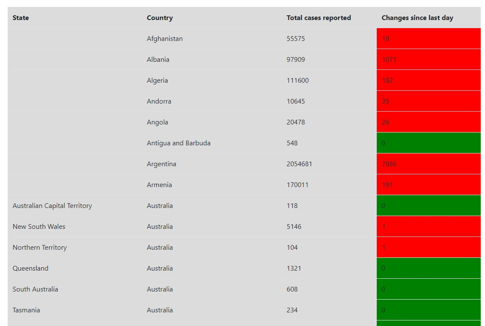
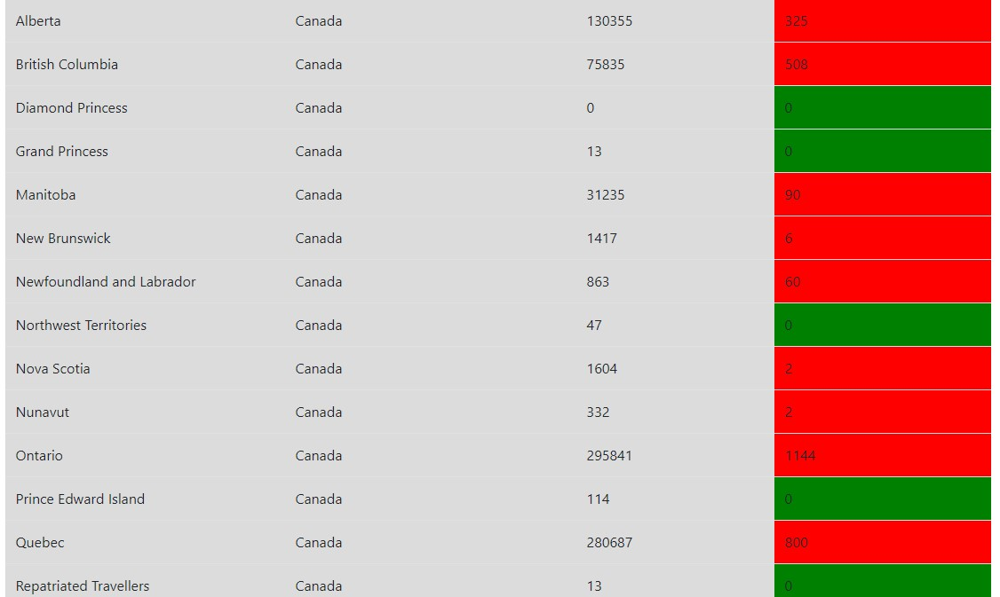
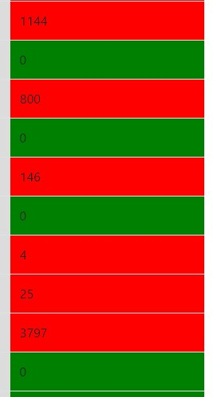

 
 Coronavirus_Tracker_Application  is an application that provides counters and real-time statistics for coronavirus.
 In the top of the page it can be seen the total worldwide cases from the begining and new cases reported since previous day
 
 

 

The table contains raported cases such as: country, state from countries, total cases from each country, new cases from previous day.

  
  

If in the previous day we have new cases, the background color is red otherwise is green

 

 
